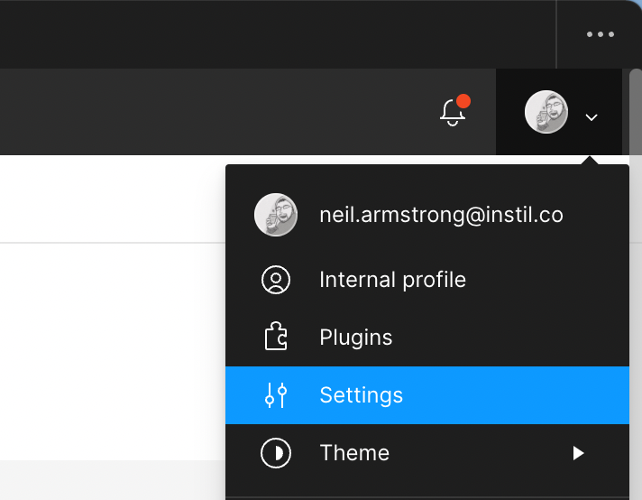

# Figma-sync

An alternative solution for syncing a figma design system from into code. Rather than the traditional approach of using a plugin within figma to generate files (a "push" model) this offers the ability to use the Figma API to "pull" from Figma directly

Currently supports
- Colours
- Spacers
- Box shadows
- Typography
- SVG icons

Ideas taken from the work of
https://blog.prototypr.io/design-tokens-with-figma-aef25c42430f#26f2
and
https://blog.jacobtan.co/extracting-svgs-using-figma-api

## Getting started (Mac)

### Required dependencies
1. Install Nodenv: https://github.com/nodenv/nodenv#homebrew-on-macos
2. Install Node version: `$ nodenv install 16.5.0`
3. Install Yarn 2: https://yarnpkg.com/getting-started/install
4. Install dependencies: `$ yarn install`
5. Test it works! `$ yarn build`

### Pointing at your environment
Create a `.env.local` at in the root directory with the following
```
FIGMA_ID=<id of the figma file>
FIGMA_API_KEY=<your figma api key>
GENERATED_FILES_DIRECTORY=<folder to put the generated files into>
```

#### Getting the id of a figma file
1. Open a figma file
2. Right click it's tab
3. Click `Copy link`

This will generate something like
```
https://www.figma.com/file/<the figma file id>/<the name of the figma file>?node-id=<some node id>
```
So copy the part after `file/`


#### Getting your figma api key
1. Click your profile picture
2. Select `Settings`
3. Scroll down to `Personal access tokens`
4. Create a new token with an understandable name (for example `Figma-sync`)




## Debugging

### Webstorm ESLint: "TypeError: this.cliEngineCtor is not a constructor"
Upgrade Webstorm to latest version, or at least `2021.3.1`
