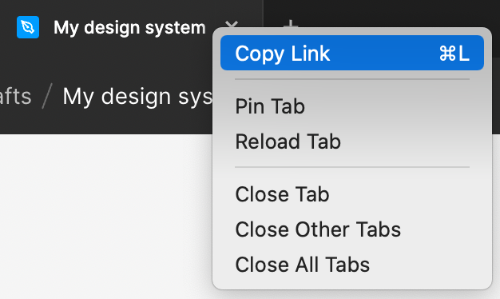

# Figma sync

An alternative solution for syncing a figma design system from into code. Rather than the traditional approach of using a plugin within figma to generate files (a "push" model) this offers the ability to use the Figma API to "pull" from Figma directly.

Currently supports
- Colours
- Spacers
- Box shadows
- Typography
- SVG icons

Ideas taken from the work of
https://blog.prototypr.io/design-tokens-with-figma-aef25c42430f#26f2
and
https://blog.jacobtan.co/extracting-svgs-using-figma-api.

## Install
`$ yarn add --dev @instil/figma-sync`

Create a `FigmaSync.config.ts` at in the root directory with the following:
```
import {FigmaSyncConfig} from "@instil/figma-sync";

const config: FigmaSyncConfig = {
  figmaPageId: "<id of the figma page to sync from>",
  figmaApiKey: "<your figma api key>",
  outputFolder: "<the folder to save the synced styles and icons>"
}

export default config;
```

### Getting the id of a figma file
1. Open a figma file
2. Right click it's tab
3. Click `Copy link`

This will generate something like
```
https://www.figma.com/file/<the figma file id>/<the name of the figma file>?node-id=<some node id>
```
So copy the part after `file/`



### Getting your figma api key
1. Click your profile picture
2. Select `Settings`
3. Scroll down to `Personal access tokens`
4. Create a new token with an understandable name (for example `Figma-sync`)


### Optional config

These optional fields are also available

```
{
  colorsConfig?: {
    includeCssVariables?: boolean; // Adds a `_colors.variables.css` file to the generated folder for use at runtime
  };
  spacersConfig?: {
    unitType: "px" | "rem";
    baseFontSize?: number; // Optional entry when using "rem" that defaults to `16. Sets the base font size to base "rem" values off of
  };
  typographyConfig?: {
    unitType: "px" | "rem";
    baseFontSize?: number; // Optional entry when using "rem" that defaults to `16. Sets the base font size to base "rem" values off of
  };
}
```

## Usage

### Sync styles (fast)
`$ yarn figma-sync`

### Sync styles and icons (slow)
`$ yarn figma-sync:withIcons`

## Helpers

A few typesafe helpers to make refactors easier to detect, and allow copy pasting from figma's "Inspect" tool

### TypographyHelpers.scss

Add the following line to your css class to use the provided mixin
```
@use "path-to-generated-folder/scss/TypographyHelpers";

.someKindOfClass {
  @include TypographyHelpers.useFont("Text/M/Regular");
}
```

### ColorHelpers.scss

Add the following line to find the correct color value
```
@use "path-to-generated-folder/scss/ColorHelpers";

.someKindOfClass {
  color: ColorHelpers.useColor("Primary/Light/60");
}
```

## Development

1. Install Nodenv: https://github.com/nodenv/nodenv#homebrew-on-macos
2. Install Node version: `$ nodenv install 16.5.0`
3. Install Yarn 2: https://yarnpkg.com/getting-started/install
4. Install dependencies: `$ yarn install`
5. Test it works! `$ yarn build`

### Syncing
Run `$ yarn sync` to begin sync

#### Icons
Syncing icons can take a _very_ long time, so to also sync icons run `$ yarn sync:icons`

## Releasing
### Login
```
$ yarn npm login
```

### Publish
```
$ yarn publish
```

## Debugging

### Webstorm ESLint: "TypeError: this.cliEngineCtor is not a constructor"
Upgrade Webstorm to latest version, or at least `2021.3.1`
